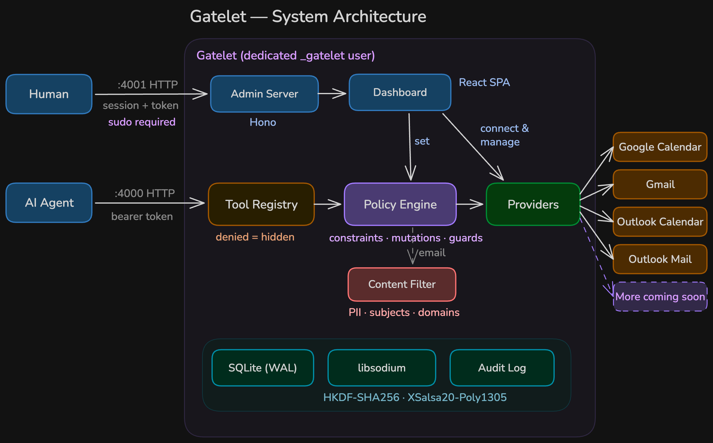

<p align="center">
  
</p>

<h1 align="center">Gatelet</h1>

<p align="center">
  <strong>Fine-grained account access for your agents.</strong><br/>
  A self-hosted MCP proxy that gives you full control over how your agents can access your mails and calendars (and soon other online accounts).
</p>

<p align="center">
  <a href="https://github.com/hannesill/Gatelet/blob/main/LICENSE"></a>
  <a href="https://github.com/hannesill/Gatelet/pkgs/container/gatelet"></a>
  <a href="https://github.com/hannesill/Gatelet"></a>
</p>

<p align="center">
  <a href="https://gatelet.dev">Website</a> · <a href="https://gatelet.dev/intro">Docs</a> · <a href="https://github.com/hannesill/Gatelet/issues">Issues</a>
</p>

---

Gatelet is a self-hosted MCP permission proxy that sits between your AI agent and your personal services. It holds OAuth credentials in encrypted storage and enforces fine-grained YAML policies — including payload mutation.

Your agent connects via a policy-enforced MCP endpoint and can only perform operations the policy allows. Operations not listed are denied. Denied tools are invisible — the agent never knows they exist.

## How It Works

<p align="center">
  
</p>

1. Connect your accounts (Google, Microsoft) via the admin dashboard on `:4001`
2. Write YAML policies that define what the agent can do
3. Agent connects to `:4000/mcp` with an API key — sees only allowed tools
4. Each tool call is validated against constraints, mutations are applied, then forwarded upstream
5. Every call is audit-logged with parameters, result, and timing

## Quick Start

```bash
# macOS / Linux
curl -fsSL https://gatelet.dev/install.sh | sh

# Windows (PowerShell)
powershell -ExecutionPolicy ByPass -Command "iex (iwr -UseBasicParsing https://gatelet.dev/install.ps1)"
```

This pulls the Docker image, generates an admin token, and starts Gatelet in `~/.gatelet`. The installer prints your admin token and dashboard URL when done.

```
open http://localhost:4001   # paste the admin token to log in
```

The dashboard walks you through setup: generate an API key, connect your accounts via OAuth, copy the MCP config into your agent. Built-in OAuth credentials are included so you don't need to register your own app.

> **Note:** The built-in OAuth credentials are not yet verified by Google or Microsoft. You'll see an "unverified app" warning during sign-in — this is expected. Gatelet is fully self-hosted: all tokens are stored locally on your machine, encrypted at rest. The built-in credentials do not give the publisher any access to your data. To avoid the warning, register your own OAuth app under **Settings > Integrations** in the dashboard.

Docker is the recommended deployment method — it provides the filesystem and network isolation the security model depends on.

## Updating

The install script includes [Watchtower](https://containrrr.dev/watchtower/), which automatically pulls new images and restarts the container. Updates are checked every 5 minutes.

To update manually instead:

```bash
cd ~/.gatelet && docker compose pull && docker compose up -d
```

Your data volume is preserved across updates.

## Supported Providers

| Provider | Tools | Built-in OAuth |
|---|---|---|
| Google Calendar | list calendars, list/get/create/update events | Yes |
| Outlook Calendar | list calendars, list/get/create/update events | Yes |
| Gmail | search, read, create draft, list drafts, send, reply, label, archive | Yes |

No delete operations are implemented for any provider. Absence of code is the strongest guarantee.

## Supported Agents

The admin dashboard can install Gatelet's MCP config directly into your agent's configuration file:

| Agent | Config file |
|---|---|
| OpenClaw | `~/.openclaw/config.json` |
| Claude Code | `~/.claude.json` |
| Gemini CLI | `~/.gemini/settings.json` |
| Codex | `~/.codex/config.toml` |

Or configure any MCP-compatible agent manually — point it at `http://gatelet:4000/mcp` (Docker network) or `http://localhost:4000/mcp` (local) with a Bearer token.

## Policies

Policies are YAML files that define what an agent can do with a connected account. Here's an example:

```yaml
provider: google_calendar
account: me@gmail.com

operations:
  list_calendars:
    allow: true

  list_events:
    allow: true

  create_event:
    allow: true
    constraints:
      - field: calendarId
        rule: must_equal
        value: "primary"
    mutations:
      - field: attendees
        action: set
        value: []
      - field: visibility
        action: set
        value: "private"

  # update_event: not listed → denied by default
  # delete_event: not implemented in code → impossible
```

### Constraints

Validate input fields before the call is made. If a constraint is violated, the call is rejected with a message showing expected vs actual values — so the agent can self-correct.

| Rule | Description |
|---|---|
| `must_equal` | Field must exactly match the given value |
| `must_be_one_of` | Field must be one of the values in the given array |
| `must_not_be_empty` | Field must not be null, empty, or whitespace |
| `must_match` | Field must fully match a regex pattern (JavaScript syntax, case-sensitive) |

### Mutations

Modify fields before sending upstream. The agent never knows. Use these to strip attendees, force private visibility, or set default values.

| Action | Description |
|---|---|
| `set` | Set the field to a given value (supports nested paths via dot notation, e.g. `start.timeZone`) |
| `delete` | Remove the field entirely |

### Field Policies

Operations can optionally restrict which fields the agent is allowed to send:

```yaml
create_event:
  allow: true
  allowed_fields: [calendarId, summary, start, end]   # only these fields accepted
  # or:
  denied_fields: [attendees, guestsCanInviteOthers]    # these fields stripped
```

`allowed_fields` is a whitelist — all other fields are stripped. `denied_fields` is a blacklist — listed fields are stripped. Use one or the other (not both).

## Email Content Filters

Gmail's `search` and `read_message` operations run messages through a content filter pipeline before returning them to the agent. Filters are configured as `guards` in the policy YAML.

### Filter Pipeline

Messages pass through three stages in order:

1. **Subject blocking** — If the subject contains any blocked pattern, the entire message is blocked
2. **Sender domain blocking** — If the sender's email domain matches, blocked
3. **PII redaction** — Regex patterns replace sensitive data in the message body

Blocked messages return a notice — the agent knows the message exists but cannot read its content.

<details>
<summary><strong>Default blocked subjects</strong></summary>

`password reset` · `reset your password` · `verification code` · `security code` · `two-factor` · `2FA` · `one-time password` · `one-time pin` · `one-time code` · `OTP` · `sign-in attempt` · `login alert` · `security alert` · `confirm your identity` · `einmalcode` · `sicherheitswarnung` · `sicherheitscode`

</details>

<details>
<summary><strong>Default blocked sender domains</strong></summary>

`accounts.google.com` · `accountprotection.microsoft.com`

</details>

<details>
<summary><strong>Default PII redaction</strong></summary>

| What | Example | Replaced with |
|---|---|---|
| Social Security Number | `123-45-6789` | `[REDACTED-SSN]` |
| Credit card (4x4) | `4111 1111 1111 1111` | `[REDACTED-CC]` |
| Credit card (Amex) | `3782 822463 10005` | `[REDACTED-CC]` |
| CVV code | `CVV: 123` | `CVV [REDACTED]` |
| Passport number | `C12345678` | `[REDACTED-PASSPORT]` |
| Bank routing number | `routing: 021000021` | `routing [REDACTED]` |
| Bank account number | `account: 12345678901` | `account [REDACTED]` |

Prices, dates, order numbers, tracking numbers, phone numbers, flight numbers, ZIP codes, and confirmation codes are **not redacted** — agents need these to be useful.

</details>

### Customizing Filters

Edit the policy YAML for any Gmail connection in the admin dashboard:

```yaml
operations:
  search:
    allow: true
    guards:
      block_subjects:
        - my custom blocked subject
      block_sender_domains:
        - spam-domain.com
      redact_patterns:
        - pattern: "\\bSECRET-\\d+\\b"
          replace: "[REDACTED]"

  read_message:
    allow: true
    guards:
      block_subjects:
        - my custom blocked subject
      block_sender_domains:
        - spam-domain.com
      redact_patterns:
        - pattern: "\\bSECRET-\\d+\\b"
          replace: "[REDACTED]"
```

Patterns use JavaScript regex syntax with case-insensitive and global flags.

## Security Model

| Principle | How |
|---|---|
| **Two trust domains** | Agent-facing (`:4000`) and admin-facing (`:4001`) are separate servers on separate ports |
| **Deny by default** | Operations not listed in a policy are denied |
| **Hidden denied tools** | Agents never see tools they can't use — they don't know they exist |
| **Defense in depth** | Dangerous operations (calendar delete) are not implemented as code |
| **Encryption at rest** | Master key derived from admin token via HKDF-SHA256; credentials encrypted with XSalsa20-Poly1305 (libsodium) |
| **HTTP transport only** | Gatelet is never a child process of the agent — no shared memory, no stdio |
| **Audit everything** | Every tool call logged with original params, mutated params, result, and timing |
| **Payload mutation** | Even when an operation is allowed, mutations can strip or override fields before the upstream call |
| **Rate limiting** | Failed auth attempts (admin and API key) are rate-limited per IP (10 per minute) |

### Why Not a CLI?

Many MCPs are thin API wrappers that would be better as CLIs invoked by agent skills. Gatelet is not one of them — it's a security boundary, not a tool.

- **Network isolation is the point.** Gatelet runs as a separate HTTP service, never as a child process. A CLI runs inside the agent's sandbox, sharing filesystem and process access.
- **Tool visibility requires protocol-level control.** Gatelet only registers allowed tools in MCP — denied tools don't exist. A CLI can only return "not found" errors after the fact, leaking what operations exist.
- **Credentials never touch the agent process.** OAuth tokens live in Gatelet's encrypted database, accessed only over HTTP.
- **Transparent policy enforcement.** The agent calls `gmail_search` thinking it's talking to Gmail. Gatelet silently applies mutations, strips fields, and audits everything.

## Configuration

| Variable | Default | Description |
|---|---|---|
| `GATELET_MCP_PORT` | `4000` | MCP server port (agent-facing) |
| `GATELET_ADMIN_PORT` | `4001` | Admin API port (human-facing) |
| `GATELET_DATA_DIR` | `~/.gatelet/data` | SQLite database location |
| `GATELET_ADMIN_TOKEN` | auto-generated | Admin dashboard token |
| `GATELET_TRUST_PROXY` | — | Set to any value to trust `X-Forwarded-For` for client IP extraction (required behind a reverse proxy) |

OAuth credentials can be configured through the admin dashboard under Settings > Integrations.

## Docker

The install script sets up Docker Compose automatically. The `docker-compose.yml` uses two networks for isolation:

- **gatelet-internal** — Other containers (your agent) connect to Gatelet on `:4000`. Not published to the host.
- **gatelet-egress** — Allows Gatelet to reach external APIs (Google, Microsoft).

Admin port is bound to `127.0.0.1` only — not accessible from the network.

To build from source:

```bash
npm run docker:build
docker compose up -d
```

## Development

```bash
npm install
npm run dev          # Start API + dashboard (Vite dev server)
npm test             # Run tests (vitest)
npm run test:watch   # Watch mode
npm run build        # Build dashboard + API (tsup → dist/)
npm start            # Run production build
```

### Doctor

Health checks for verifying your setup:

```bash
gatelet doctor          # Run all checks
gatelet doctor --fix    # Auto-fix what's fixable
gatelet doctor --json   # Machine-readable output

# Or via npm scripts during development:
npm run doctor
npm run doctor:fix
```

### Project Structure

```
src/
  admin/       Admin API + routes (Hono on :4001)
  db/          SQLite + encrypted credential storage (libsodium)
  doctor/      Health checks (CLI + admin API)
  mcp/         MCP server (raw HTTP on :4000, Streamable HTTP transport)
  policy/      Policy engine (pure functions, no side effects)
  providers/   Provider implementations
    google-calendar/    Google Calendar via googleapis
    outlook-calendar/   Outlook Calendar via Microsoft Graph
    gmail/              Gmail via googleapis
    email/              Shared email types, content filters, HTML stripping
  config.ts    Environment variable config
  index.ts     Entry point
  cli.ts       CLI entry point (gatelet, gatelet doctor)
dashboard/     Admin dashboard (React, Vite, Tailwind)
website/       Landing page (Astro, gatelet.dev)
```

## License

[MIT](LICENSE)
